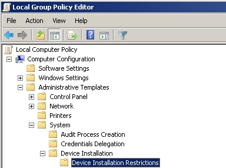
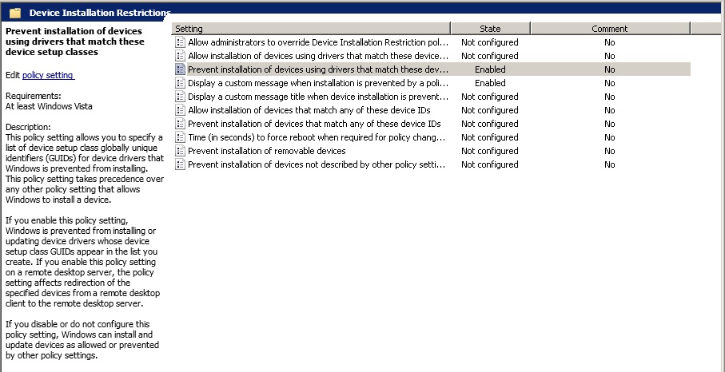
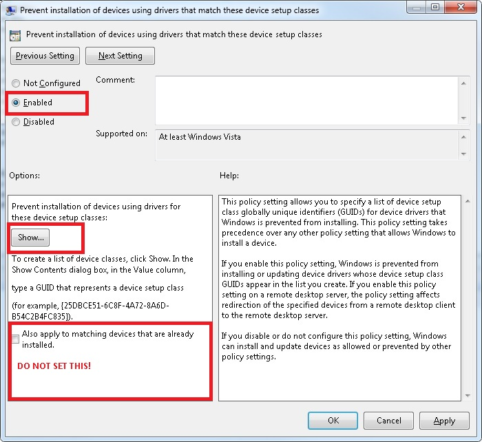
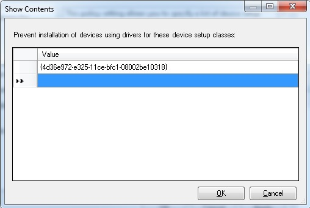

# Blocking the Lan Turtle / Poison Tap / Bash Bunny and other cruft

http://passing-the-hash.blogspot.de/2017/03/blocking-lan-turtle-poison-tap-bash.html?m=1

I've been doing this for a long time.  So I've researched, discovered, implemented, and forgotten a ton of stuff.  I should probably start up a blog just for stuff that I've forgotten ;-)

So I first thought about it when the HAK5 turtle showed up (link here: https://lanturtle.com/) ....  I thought to myself  "oh yeah, I totally know how to stop that, I aught to write up a blog post about it..." and then life happened....  then Mubix posted something that at the time about using  a USB armory to do similar stuff (link here: https://room362.com/post/2016/snagging-creds-from-locked-machines/) .... and the lightbulb went on then went out again...  Then I read about the poisontap (link here: https://samy.pl/poisontap/) , and I was like oh yeah... I really aught to do that blog post.... then life... etc...

So I then I saw the new Bash Bunny (https://hakshop.com/products/bash-bunny) and figured I aught to get off my ass...

I originally found this while researching how to prevent the tool 'inception' from working...  (link here: http://www.breaknenter.org/projects/inception/) The TLDR for this attack is that firewire and thunderbolt both allow direct memory access (DMA) when prodded the right way.  This is a Bad Thing (tm) for people like me to be able to do ;-)  There is a way with GPO to block the loading of the drivers that make it work, which is documented on the MS site.

Microsoft was kind enough to put a page up describing what needs to be done.  (Link here: https://support.microsoft.com/en-us/kb/2516445) 

I'm going to demonstrate a general method for preventing these sorts of attacks and my thinking behind it.  The usual caveat applies, always test in a lab environment before deploying anything like this.  It could have disastrous consequences if not used properly.  However, I believe the impact should be minimal the way I'm suggesting you address the problem.  This method is Windows specific as I feel that is the largest attack surface...

## Quick Background
Devices like the Beaglebone, the Pi, or the USB armory take advantage of a feature in the Linux kernel called a USB gadget (link: http://www.linux-usb.org/gadget/).  Essentially the gadgets allow the Linux device to emulate several different common USB devices, such as a network adapter, USB keyboard, USB mass storage drive, and sometimes several at the same time .  In this case, the Linux device emulates a USB network adapter.  Windows has built-in drivers for the type of device presented, so they will automatically load.  The name of the device as it appears on Windows is a "RNDIS/Ethernet Gadget".

__Note__ The Lan Turtle actually presents as a different network card which has Windows driver support directly.  The Bash Bunny is new (March 1, 2017) and I haven't seen or played with one, so I don't know how it presents, however, I know the most likely candidate is going to be the USB Multi Gadget...

## Getting Started
Both of these methods use a Group Policy Object (GPO) to prevent the driver from being loaded.  This also works on computers that are not attached to a domain by using the local 'gpedit.msc' panel.

Starting 'gpedit.msc' from a command prompt brings up the following window.  I have highlighted the path we are looking for:

Underneath "Device Installation Restrictions" we have the following items.  The ones we are interested in are primarily "Prevent installation of devices using drivers that match these device setup classes" and  "Prevent installation of devices that match any of these device ID's".

A brief overview of the two options:
* "Prevent installation of devices using drivers that match these device setup classes"
  * This is a more general option suited to stop entire classes from loading IE network cards
  * This is the option I'm recommending
* "Prevent installation of devices that match any of these device ID's"
  * This option is more specific
  * I *suspect* (unproven) that this could be worked around
  * Would need multiple items for each specific device
  * Not the way I'm recommending solving it
## How to Break the Devices
The way the Poisontap and the Bash Bunny (informed speculation) work is that they present as a high speed network device with drivers that are built into Windows.  By default, when a Windows box gets a new network interface up, it tries to use DHCP to acquire an IP address.  Since these devices have a DHCP server, the device gets an IP address and is considered fit for duty by Windows.  By stating to Windows the device is high speed, that forces the Windows TCP/IP stack to assign it the highest priority when sending out network traffic, which allows all sorts of interesting MITM attacks, such as leveraging responder for creds...

The easiest way to break this is to simply prevent the device from getting a driver.  This is actually fairly straight forward using the "Prevent installation of devices using drivers that match these device setup classes" option above.  If we combine this with the generic network device GUID, this means that no NEW network devices can be added to the system.

**There is an option to make this apply to devices that are already installed.  ''DO NOT CHECK THIS BOX! Only death and misery follow if you pushed out a network wide GPO with that checkbox enabled!''**

I think, if applied correctly, (unless somebody can prove me wrong) that this is a fairly low risk enhancement to the security posture. 

The risk (as I see it) comes from whenever you add a 'network device' to the system.  How often does this happen given the average business class hardware?  Most systems I have seen in use in a corporate environment have wired / wireless built in.  I have, on occasion, seen an external wireless adapter, but those are mostly exceptions to the rule. 

Existing network connections will not be affected (as long as you don't hit the checkbox I warned about above), so presumably since it can connect to the domain everything is working... it would only be if you needed to add a device or possibly change a device, which shouldn't be an everyday event...

The only occasions I see this being a problem would be if something like VMWare Workstation was added to the system, but then you could temporarily disable the setting, install the software, and then reapply the GPO.  It is also possible that some VPN software could also trip this up, but I *suspect* that if you started the VPN once while the GPO was disabled it would still work, however that would require further testing.

## How to actually do it
From here (link: https://msdn.microsoft.com/en-us/library/windows/hardware/ff553426(v=vs.85).aspx) the specific class GUID for network adapters is `{4d36e972-e325-11ce-bfc1-08002be10318}`

So to prevent new adapters from being installed, select "Prevent installation of devices using drivers that match these device setup classes"

Worth mentioning again:
**There is an option to make this apply to devices that are already installed.  ''DO NOT CHECK THIS BOX! Only death and misery follow if you pushed out a network wide GPO with that checkbox enabled!''**

Hitting the 'Show' Button brings up this dialog box:

Simply copy and paste the GUID from above into the box and hit OK.  In this example I have already done this.  Hit Ok, then Apply and boom.

Whenever a new network device gets plugged in it will fail!
## Final Caveat
I suspect there will be ways around this, like any mitigation.  However my feelings are that if you can force the bad guys to up their game and screw over the skiddies who don't what they are doing, both of those are a net win.  There will always be a window one could use to bypass a door... 

tags: #blueteam #hardware #pentest #windows #links #gpo 
