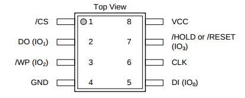

# FT2232 Notes
I have a couple of breakout boards that use the FTDI FT232H or FT2232H.

## Pinout
### Channel A

| Pin    | UART | JTAG/SPI   |
| ------ | ---- | ---------- |
| ADBUS0 | TXD  | TCK/SK     |
| ADBUS1 | RXD  | TDI/DO     |
| ADBUS2 | RTS# | TDO/DI     |
| ADBUS3 | CTS# | TMS/CS     |

### Channel B

| Pin    | UART | JTAG/SPI   |
| ------ | ---- | ---------- |
| BDBUS0 | TXD  | TCK/SK     |
| BDBUS1 | RXD  | TDI/DO     |
| BDBUS2 | RTS# | TDO/DI     |
| BDBUS3 | CTS# | TMS/CS     |

## Dumping flash over SPI
Dumped the BIOS of a Lenovo Thinkpad 450s using this:
```
$ flashrom -p ft2232_spi:type=2232h -r bios.bin -c W25Q128.V
flashrom v0.9.9-r1954 on Linux 4.14.0-kali3-amd64 (x86_64)
flashrom is free software, get the source code at https://flashrom.org

Calibrating delay loop... OK.
Found Winbond flash chip "W25Q128.V" (16384 kB, SPI) on ft2232_spi.
Reading flash... done.
```
Did not work the first time, I had to make sure that the [SOIC clip](https://www.amazon.de/gp/product/B0713V5GGL/ref=oh_aui_detailpage_o00_s00?ie=UTF8&psc=1) I used fit correctly. It was loose at first.

The parameter `-c W25Q128.V` can be omitted, `flashrom` will detect the chip if the SOIC clip fits correctly.

| FT2232H Pin | Flash Pin | Config |
| ----------- | --------- | ------ |
| 3.3V        | pin 8     | Vcc    |
| GND         | pin 4     | GND    |
| ADBUS0/SK   | pin 6     | CLK    |
| ADBUS1/DO   | pin 5     | DI     |
| ADBUS2/DI   | pin 2     | DO     |
| ADBUS3/CS   | pin 1     | /CS    |

### SOIC pinout
The Thinkpad uses a Winbond W25Q128FV SOIC8.



tags: hardware JTAG SPI FTDI ft2232 flashrom
