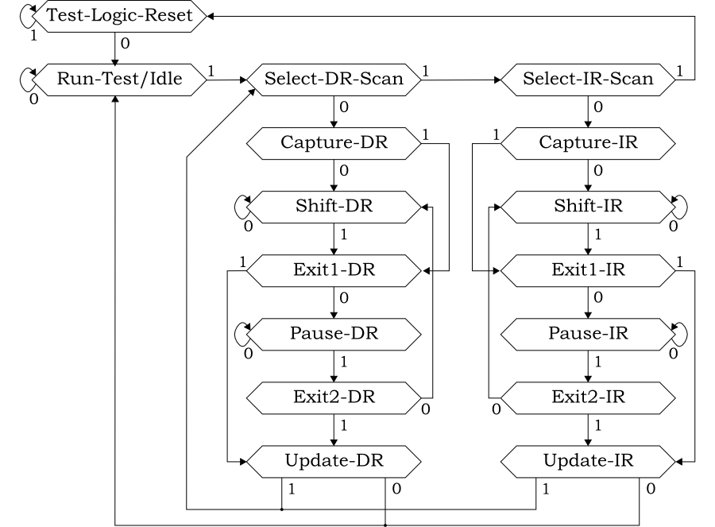
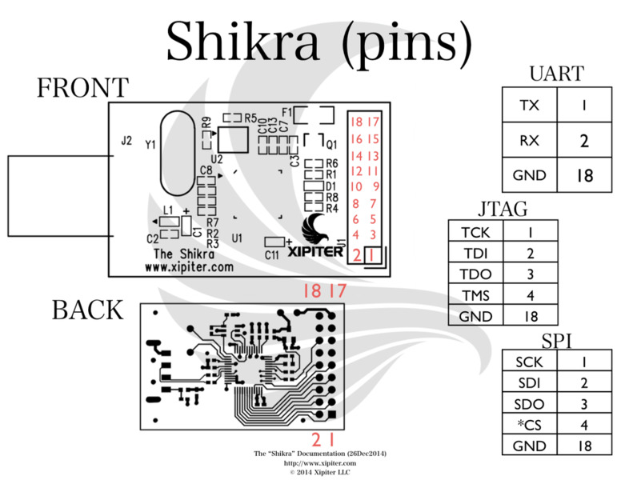

# Software Exploitation via Hardware Exploitation

## Speakers
* Stephen Ridley
* Matt Carpenter from Grimm
## Day 1

###UART
einfaches Verbinden mit UART, das die aus einem Pogoplug rausgeführt haben -> root shell, kleines bisschen persistent exploitation über ssh
habe es nicht geschafft, in der Zeit den Webserver zu finden
### ID pinouts manually
Pins verbunden mit großer Fläche -> GND
Pin mit größerer Zuführung -> vmtl. Vcc
Prüfen mit Durchgangsprüfer
Saleae kann mit AutoBaud die Baudrate bestimmen (ca. 50% korrekt)
Baudrate: bits per second
Lab:
* Ground test point gefunden
* Spannung zwischen Pins gemessen, GND und TX identifiziert
* Pins an LA angeschlossen, Analysemodul, Autobaud funktioniert nicht
### JTAG
* Daisy Chain
* TCK und TMS in jeden Chip
* TDI in ersten Chip, TDO des Chip an TDI vom nächsten Chip,
* TDO in JTAG ist TDO des letzten Chip in der Kette
#### JTAG state machine


* Fragen
  * How can I find out IR length? Are IR all fixed length?
__Notes__
* Schmartboard ist eine Art Prototyping board für Stecker und Buchsen: http://schmartboard.com/
* Video: [Felix Domke: Blackbox JTAG Reverse Engineering](https://archive.org/details/26c3-3670-en-blackbox_jtag_reverse_engineering)
* Serial Cable: green = write, white = read
* [m0nk "Hiding at Depth"](https://archive.org/details/Hiding_at_Depth) - Hiding files on mtd drives
### Dumping MTD devices over UART
Im Wesentlichen UART-Konsole aufmachen, screenlog erstellen, device auf Terminal ausgeben
dauert ewig, ist nervig
### Dumping MTD devices over network
```sh
mkfifo pipename
nc < pipename &
dd if=mtdblockdevice of=pipename
```
### To Do
* Interfaces 6: JTAG exploration
  * [ ] urjtag says TDO is always 0. Why is that?
* Interfaces 7
  * [ ] debug using gdb
## Day 3
hat über Flash-Speicher geredet
serial und parallel flash, parallel flash hat xipiter noch nicht über direktes interfacing ausgelesen, sondern über programmer (geht wohl mit arduino und GPIO)
SPI: MISO, MOSI, CLK, SS (Slave Select). Es ist wichtig zu wissen, ob SS high oder low ist (also wann geht's los)
### SPI mit BusPirate
diese SPI-Klammer auf PIN gesetzt
mit Bus Pirate in SPI-Modus gegangen, mit (1) Sniffing aktiviert
BP ist zu langsam, "Can't keep up"
### SPI mit Shikra
Shikra anstelle von BP verwendet



mit `flashrom -p ft2232_spi:type=232H -r dump.bin` versucht, Speicher auszulesen, funktioniert nicht
```
sexviahex_labuser@sexviahex-labvm:~/shared$ flashrom -p ft2232_spi:type=232H -r tplink_spi_dump
flashrom v0.9.8-r1896 on Linux 3.13.0-40-generic (i686)
flashrom is free software, get the source code at http://www.flashrom.org

Calibrating delay loop... OK.
No EEPROM/flash device found.
Note: flashrom can never write if the flash chip isn't found automatically.
```
* Problem: MCU nimmt SPI-Bus in Beschlag, man kann nicht mit Flash kommunizieren.
  * Lösung: JTAG-Interface hat Reset-Pin. Ist der auf GND gezogen, hält die CPU an und die MCU spielt nicht den SPI-Master.
Scheinbar war der Pomona-Clip defekt, mit Grabbern an den Pins geht es:
```
sexviahex_labuser@sexviahex-labvm:~/shared$ flashrom -p ft2232_spi:type=232H -r tplink_spi_dump
flashrom v0.9.8-r1896 on Linux 3.13.0-40-generic (i686)
flashrom is free software, get the source code at http://www.flashrom.org

Calibrating delay loop... OK.
Found Winbond flash chip "W25Q32.V" (4096 kB, SPI) on ft2232_spi.
Reading flash... done.
```
__Notes__
* Pomona-Clip zum Auslesen von 8-Pin-Flash
* Matt empfiehlt, beim Harware-Hacking ca. fünf Exemplare zu beschaffen. Eines geht auf jeden Fall bei der Analyse kaputt, der Rest möglicherweise.
### ARM
Branch to uneven address: THUMB mode
Branch to even address: ARM mode
## Shifting to Embedded Exploitation
* see exercise handbook for more info
* Webserver-Banner:
```
sexviahex_labuser@sexviahex-labvm:~$ curl -I 192.168.1.2/
HTTP/1.1 500 Server Error
Server: HBHTTP POGOMOBILE - 3.2.0 - Linux
Date: Thu, 01 Jan 1970 00:25:00 GMT
```
__Notes__
John Levine [Linkers and Loaders](http://www.iecc.com/linker/)
## ARM exploitation - basic_1
Bus Error an stelle `<main+20> bkpt 0x0000` - es wird ein Breakpoint gesetzt, CPU geht in Debug state, 0x0000 am Ende ist optional
`set $pc=0xXXXX` setzt den program counter auf die Instruktion danach.

tags: hardware reversing training notes
