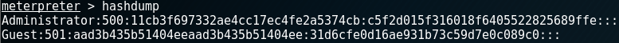
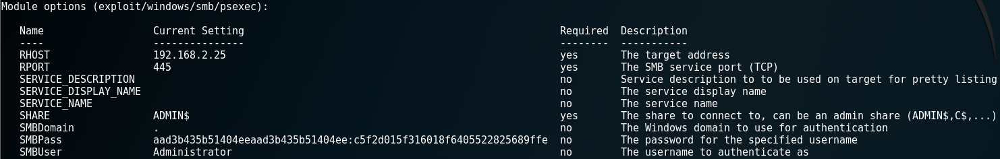
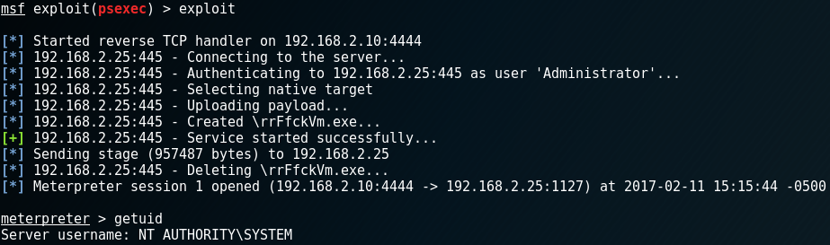
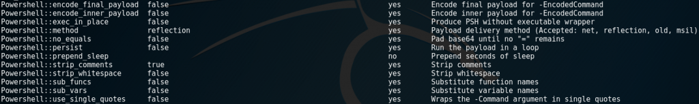

# Lateral Movement: An Overview
https://www.toshellandback.com/2017/02/11/psexec/

During the early stages of an engagement, penetration testers look to gain a foothold into the target network.  Depending on what scenarios are agreed upon by the client and laid out in the Rules of Engagement, this foothold may occur through social engineering attacks such as phishing campaigns or by compromising an external-facing web application and moving onto the server or back-end database.  Other scenarios might include executing an “Assumed Breach”, where the client creates a standard Domain user for the purposes of testing impact post-compromise.

Regardless of the method utilized for gaining the initial foothold, penetration testers are often looking for ways to move around the client’s network (referred to as lateral movement or lateral spread).  Other machines may hold goodies that further the engagement, whether it is documents that contain the company’s “crown jewels” or stored credentials that give access to databases, Domain Controllers, or other important assets.  While there is an art to gaining situational awareness and understanding the “lay of the land” once the initial foothold is established, this article will instead focus on a subset of tools and techniques for moving around the victim’s Windows environment.
## What Is “Pass The Hash?”
Pass The Hash is a technique utilized by penetration testers as well as attackers after an initial foothold to authenticate to other networked Windows machines with compromised NT LAN Manager (NTLM) password hashes.  This is possible due to how Windows implements its NTLM authentication scheme.  After login, attempts to authenticate to other networked computers, file shares, and other resources with NTLM will result in a challenge/response which includes the user name and password hash (computed with the original challenge value).  No plaintext password ever exchanged!   These hashes are stored in several places.  For local accounts, each machine will store the associated hash values in the Security Account Management (SAM) Database. In a Domain environment, hashes for all accounts in Active Directory are stored on the Domain Controller in a file called “NTDS.dit”.  Finally, credentials can also be stored in memory (plaintext in some cases) during interactive sessions such as logging in at the console or  through remote sessions (RDP).  HOLY EXPOSURE, BATMAN!

It is important to note that accessing these credentials requires privileged access (SYSTEM, Local/Domain Administrators) to the SAM database for local accounts or Local Security Authority Subsystem Service (LSASS) process for interactive logins, and while the art of harvesting these credentials is outside the scope of this article, it will be explored in a future blog post.  For more information on privilege escalation techniques, please see my November 2015 post:  [Well, That Escalated Quickly...](http://www.toshellandback.com/2015/11/24/ms-priv-esc/)

Once hashes are obtained, cracking them to uncover the plaintext password can be a long and arduous task (assuming the passwords don’t succumb to wordlists or rainbow table attacks).  Luckily for us, Windows will gladly accept NTLM hash values in many situations, such as accessing a network resource by its IP address (vs. hostname) or connecting to a device that isn’t joined to the Domain.  The only only time hashes would not be exchanged would be when requesting network resources in a Kerberos-exclusive environment, but that type of implementation is rare and can be problematic for many organizations to implement.

While this all is interesting, is there a way we can exploit these captured hashes to move deeper into the network?  There certainly is, but let’s first explore the tool that inspired arguably the most notorious of Metasploit modules…
## Sysinternals PsExec
PsExec is part of Microsoft’s Sysinternals suite, a set of tools to aid administrators in managing their systems.  PsExec allows for remote command execution (and receipt of resulting output) over a named pipe with the Server Message Block (SMB) protocol, which runs on TCP port 445.  The PsExec tool requires that the executable be present on the system performing the administration, but no additional software is necessary on target clients.  Additionally, the credentials supplied to PsExec for authentication must have elevated privileges on the targeted client machine.  At a high-level, the PsExec program works as follows:
* Connects to the hidden ADMIN$ share (mapping to the C:\Windows folder) on the remote system via SMB
* Utilizes the Service Control Manager (SCM) to start the PsExecsvc service and enable a named pipe on the remote system
* Input/output redirection of the console is achieved via the created named pipe
  For more information on the SCM and it’s role in managing services, once again refer to my November 2015 blog post:  [Well, That Escalated Quickly...](http://www.toshellandback.com/2015/11/24/ms-priv-esc/)

Let’s see what this looks like in practice.  For this scenario, I’m a system administrator and I want to simply query the remote machine ENVY to see what its network settings look like without having to initiate a remote desktop session.  When using a Domain account, be sure to include the Domain (Domain\Username format) as part of the user argument (-u flag).  This addition is not necessary for local accounts.
```
psexec \\Envy -u Inferno\SteveDA -p P@ssword123! ipconfig
```
WONDERFUL!  As you can see, we authenticated over SMB with our privileged credentials, ran a command, and received the output results locally.  What if we want to step it up a notch?  How about… an interactive shell?
```
psexec \\Envy -u Inferno\SteveDA -p P@ssword123! cmd.exe
```
YEP!  PSEXEC CAN AND WILL!  All we need to do was to simply append the cmd.exe program as an argument to the end of our command.

Note: Not supplying a username is the same as running the command under the context of your current account.
We can even have commands and/or programs run under SYSTEM instead of our account privileges by utilizing the -s flag.
```
psexec \\Envy -u Inferno\SteveDA -p P@ssword123! -s cmd.exe
```
As you are beginning to see, PsExec provides the ability to easily control of multiple machines on a network.  That should be sweet, sweet music to the ears of both penetration testers and bad guys alike.  There are, however, some caveats (naturally).  First of all, given that this is a tool built to assist system administrators in their duties, there is no reason for it to accept hashes in place of plaintext passwords, despite multiple blog posts claiming otherwise.  In order to use PsExec with captured hashes, you need the help of a tool like [Windows Credential Editor (WCE)](http://www.ampliasecurity.com/research/windows-credentials-editor/).  This presents it’s own set of issues, as yu will be required to drop another executable to disk and risk detection.  That being said, the following is a good reference if you are interested in learning more: [Pass The Hash Without Metasploit](http://fzzynop.blogspot.com/2012/09/pass-hash-without-metasploit.html).

That all being said, if during an engagement, you uncover plaintext passwords stored in memory, tucked away in a file, or residing in the SYSVOL folder on the Domain Controller (see my August 2015 blog post: [What You Know Bout GPP???](http://www.toshellandback.com/2015/08/30/gpp/), you have the green light to exploit without additional tools.  However, the other caveat is that you still need to drop the PsExec executable on a machine you control to get started.  Normally, programs signed by Microsoft are ignored by anti-virus (A/V) products.  In the case of PsExec, because it has been so widely (ab)used, some A/V products will trigger on the program as suspicious/malicious.  As we all know, unwanted attention is never a good thing!

Now lets take a look at one of the most popular tools inspired by Microsoft’s PsExec: the Metasploit PSExec module.  This module expands on PsExec’s functionality and makes it a little more penetration test friendly by allowing for the passing of compromised hashes…
## Metasploit’s PSExec Module
There are several modules within the Metasploit Framework that leverage PsExec-style techniques; however, when you hear someone refer to the PSExec module, they are most likely referring to: ```exploit/windows/smb/psexec```.  This is the module that allows for code execution on the target machine, returning a payload (usually a Meterpreter shell) to the attacker.

While similar in functionality to Sysinternal’s PsExec, the Metasploit Framework’s PSExec Module has a few key differences and at a high-level performs the following actions.  By default, the module takes the following actions:
* Creates a randomly-named service executable with an embedded payload
* Connects to the hidden ADMIN$ share on the remote system via SMB
* Drops malicious service executable onto the share
* Utilizes the SCM to start a randomly-named service
* Service loads the malicious code into memory and executes it
* Metasploit payload handler receives payload and establishes session
* Module cleans up after itself, stopping the service and deleting the executable
  There is more flexibility with the Metasploit’s PSExec in comparison to Microsoft’s tool.  For instance, the default location of the malicious service executable can be modified from the hidden ADMIN$ to C$ or even another shared folder on the target machine.  Names of the service executable and associated service can also be changed under the module’s Advanced settings.

However, the most important modification that a penetration tester can make is creating and linking to a custom service executable instead of relying on the executable templates provided by the Metasploit Framework.  Failure to do so greatly increases the risk of detection by the target system’s anti-virus solution once the executable is dropped to disk.  You can read more about why this is in my September 2015 blog post:  [A/V Ain’t Got Nothing On Me!](http://www.toshellandback.com/2015/09/30/anti-virus/)
Let’s walk through  lateral movement example with the psexec module.  For this scenario, we have already compromised one host and dumped the hashes from the SAM database:

SWEET!  We have Local Administrator credentials!  We can then take known username and password hash and set them within the psexec module.  Given that this is a Local account, there is no need to fill out the SMBDomain field.  Next, we will target another machine we have discovered on the network, SLOTH, an outdated XP machine that time and sysadmins forgot!

With all this information entered, it’s time to attempt to exploit our victim:

You can see that the psexec module created a randomly-named service executable and after connecting to SLOTH’s ADMIN$ share, drops it to disk and executes it.  We then get back a Meterpreter shell and see that we are operating under SYSTEM privileges.
You might ask yourself… why isn’t the shell running under the context of Administrator account since we used those credentials to connect?  The answer lies with the service executable.  When executed, it stands up a service and instructs it to handle the Meterpreter payload.  Given that Windows services tend to run as SYSTEM, the shell sent to us by the generated service is running under said privileges.
## The Power Of PowerShell
This is all well and good, but what if we could use PSExec tehniques but avoid the whole mess of dropping a service executable to disk and risking detection?  Only in your wildest dreams, you say? NAH, BRAH… REAL LIFE! There is a PowerShell-based version of PSExec within the Metasploit Framework: ```exploit/windows/smb/psexec_psh```.
This module allows for PSExec-style functionality but with the added bonus of everything being executed in memory and never having to touch disk!  If this sounds familiar, Raphael Mudge (@armitagehacker) implemented a very similar approach within Cobalt Strike.  At a high-level, the psexec_psh module works as follows:
* Embed stager into a PowerShell script that will inject the payload into memory

* Compress and Base64 encode the PowerShell script

* Wrap encoded script into a PowerShell one-liner that decodes and deflates

* Connect to ADMIN$ share on target machine over SMB and run the one-liner

* Embedded script is passed into memory via PowerShell’s Invoke-Expression (IEX)

* Script creates a new service and passes stager payload into it

* Metasploit payload handler receives payload and establishes session

* Module cleans up after itself by tearing down the service

This past Spring / Summer, I noticed that the psexec_psh module had been listed as ‘deprecated’ within Metasploit and that the original psexec module had been updated to include the PowerShell functionality.  The updated psexec module first checks for the presence of PowerShell on the host, and if found, will leverage the method described above.  If PowerShell is not installed on the target, the module will revert to the “old school” method of dropping a service executable onto the victim machine.  The PowerShell-related commands within the psexec module can be found under the Advanced settings:
  
Recently, the psexec_psh module appears to have been resurrected, no longer being listed as deprecated.  Confused, I reached out to OJ Reeves ([@thecolonial](https://twitter.com/TheColonial)), a well-known contributor to the Metasploit Project, for clarification.  I learned that while the PowerShell-specific code is basically identical between the two modules (as I had originally suspected), there have been circumstances where the psexec module fails to execute properly while the psexec_psh module is successful.  Until the reliability of the code within the psexec module matches that of psexec_psh, it would appear that the latter is here to stay.
This time around, let’s use our previously compromised Administrator credentials to target ENVY, a Windows 7 box.  Given that PowerShell is installed on this version of Windows by default, we will leverage the psexec_psh module.  The setup is similar to before, filling out the appropriate options. Once executed, the module runs and returns a Meterpreter shell to our attacking machine. No mention of service executables this time around as no binaries were dropped!  If we were use the original psexec on the same Windows 7 box, it would automatically detect PowerShell on the machine and leverage the same code as psexec_psh.

## Interactive Logon
Sometimes accounts to which we have obtained credentials to don't have the permission to perform an interactive logon. The following overview shows which technique requires it and which doesn't.

### PSEXEC
Requires interactive logon when used with -u to provide (different) credentials. Does not require interactive login when used on a system where the target user is already logged in (even when connection to remote hosts with that user). Link: https://digital-forensics.sans.org/blog/2012/12/17/protecting-privileged-domain-accounts-psexec-deep-dive

### RUNAS
Requires interactive logon.

### PSRemoting
Does not create an interactive logon.  

Pretty sweet, right?
## Trouble In Lateral Movement Paradise
When the stars align, using PSExec to pass the hash (and let’s not forget – cleartext passwords!) can quickly allow one to compromise vast portions of a network.  That being said, there are certain situations that can hamper our efforts to spread laterally.
### Security Update KB2871997

March 2017 Update:  As Will Schroeder (@harmj0y) points out in his new post:  [Pass-the-Hash Is Dead: Long Live LocalAccountTokenFilterPolicy](https://www.harmj0y.net/blog/redteaming/pass-the-hash-is-dead-long-live-localaccounttokenfilterpolicy/), there was confusion in the offensive security realm regarding Microsoft’s KB2871997 Security Update and the resulting impact on pass-the-hash attacks.  What was largely attributed to the Security Update (including Will’s 3-year-old [Pass-the-Hash Is Dead: Long Live Pass-the-Hash](https://www.harmj0y.net/blog/redteaming/pass-the-hash-is-dead-long-live-localaccounttokenfilterpolicy/) blog post and until today, this post) is actually the UAC restrictions I had listed above.  Will has gone even deeper into those issues than I have, and the aforementioned post is worth a look for a deeper understanding of Admin Approval Mode and User Account Control Remote Settings!

~~If you recall, in the examples for both the Sysinternal’s PsExec and Metasploit’s PSExec, it was mentioned that you must have privileged access to the machine you are targeting in order to  be successful.  This means you have credentials for an account that is part of the Local Administrators group.  These can be Local or Domain Accounts.  Over time, Microsoft felt pressure to start to address some of the security issues inherent with Windows, and around mid-2014, took some steps in the right direction when they released [KB2871997](https://technet.microsoft.com/library/security/2871997).
All this being said, RID 500 Local Administrator accounts and Domain accounts with Local Administrator access on target machines (Domain Administrators, among others) are still fair game!  If you are interested in learning more, Will Schroeder ([@harmj0y](https://twitter.com/harmj0y) has a fantastic discussion of the implications of KB2871997 for penetration testers: [[Pass-the-Hash Is Dead: Long Live Pass-the-Hash|http://www.harmj0y.net/blog/penetesting/pass-the-hash-is-dead-long-live-pass-the-hash/]]. ~~
### Admin Approval Mode & User Account Control Remote Settings
A while back, I was on an internal network engagement, and the stars seemed to align.  I had a Domain user account that, through overly-permissive rights, granted me the equivalent of Local Administrator privileges for that particular machine.  Using this access, I was able to snag the RID 500 account after dumping all hashes from the SAM database.  However, when I went to use PSExec to authenticate to another machine on the network (I had knowledge that the client was in fact using standard credentials for the built-in Administrator across a majority of machines), I was unable to gain access.
Stumped, I did a lot of digging and Google searching, finally figuring out what was halting my lateral movement attempts.  Pulling up the registry for the machine, I discovered that the follow registry key was enabled:
```HKLM\SOFTWARE\Microsoft\Windows\CurrentVersion\Policies\System\FilterAdministratorToken```
This setting is known as Admin Approval Mode.  When explicitly enabled (disabled is default), this mode enforces [User Account Control (UAC)](https://technet.microsoft.com/en-us/library/cc709691.aspx) for the built-in Administrator, which is otherwise unaffected by the Microsoft security feature.  First introduced in Windows Vista, UAC prompts the user when an action requires elevated rights.  As we know, PSExec tries to remotely map to the ```ADMIN$``` or ```C$``` shares in order to kick off a malicious payload, which requires privileged access.  With no way to bypass UAC, the module’s attempt to stand up the service would fail, with no shells to be had.  LE SIGH…
Let’s take Admin Approval Mode out of the equation now.  By default, UAC affects remote access in the following ways.  For all Local accounts (with the exception of the RID 500 Administrator), all privileged administrative actions must occur by physically logging in at the console or through RDP.  Domain accounts with Local Administrator privileges, such as Domain Administrators, do not receive UAC prompts when performing remote command execution over SMB.  This behavior is set at the following registry location:
```HKLM\SOFTWARE\Microsoft\Windows\CurrentVersion\Policies\System\LocalAccountTokenFilterPolicy```
If the LocalAccountTokenFilterPolicy registry key does not exist or is disabled (value: 0), then the behavior for remote access is as described above.  However, if system administrators have explicitly enabled this feature (value: 1), then the UAC remote restrictions for Local accounts are lifted.
## Where Do We Go From Here?
While PSExec and all its SMB goodness has arguably been the lateral movement technique of choice for many a penetration tester in the past, others are started to leverage different protocols and methods to spread across networks.  Windows Management Instrumentation (WMI) and PowerShell Remoting (PSRemoting) have been gaining traction among the ethical hacking community as details of Advanced Persistence Threat (APT) campaigns have revealed the bad guys are changing their tactics and techniques.

//Special thanks to Raphael Mudge (@armitagehacker) and OJ Reeves (@thecolonial)  for their assistance during the creation of this blog post!//

tags: Links Pentest Windows