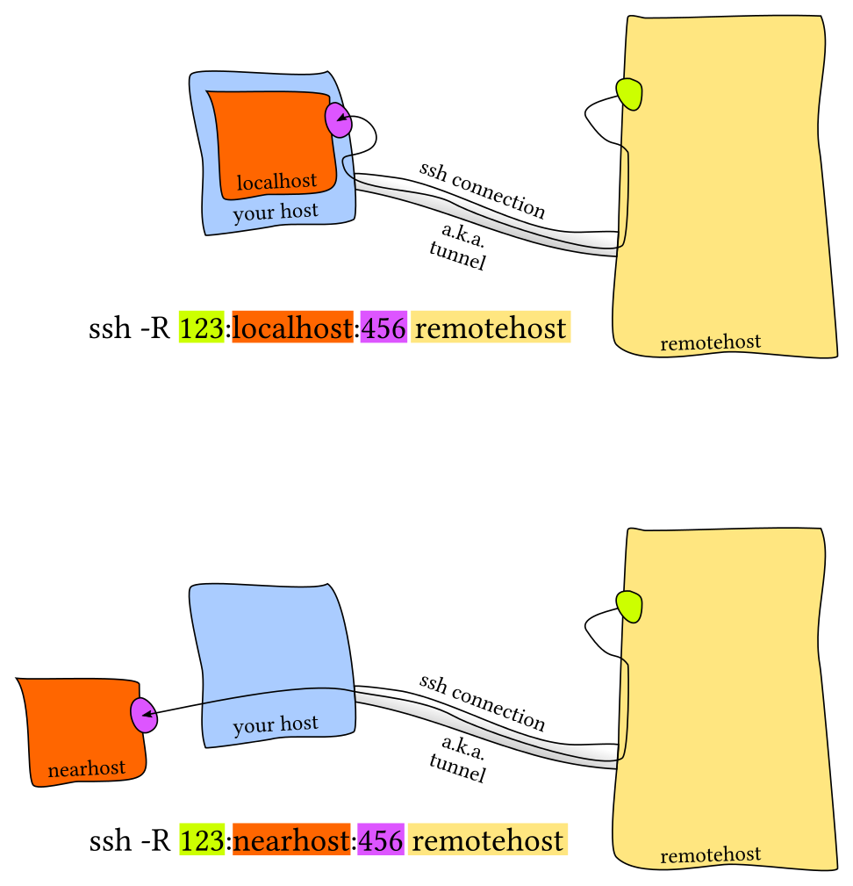
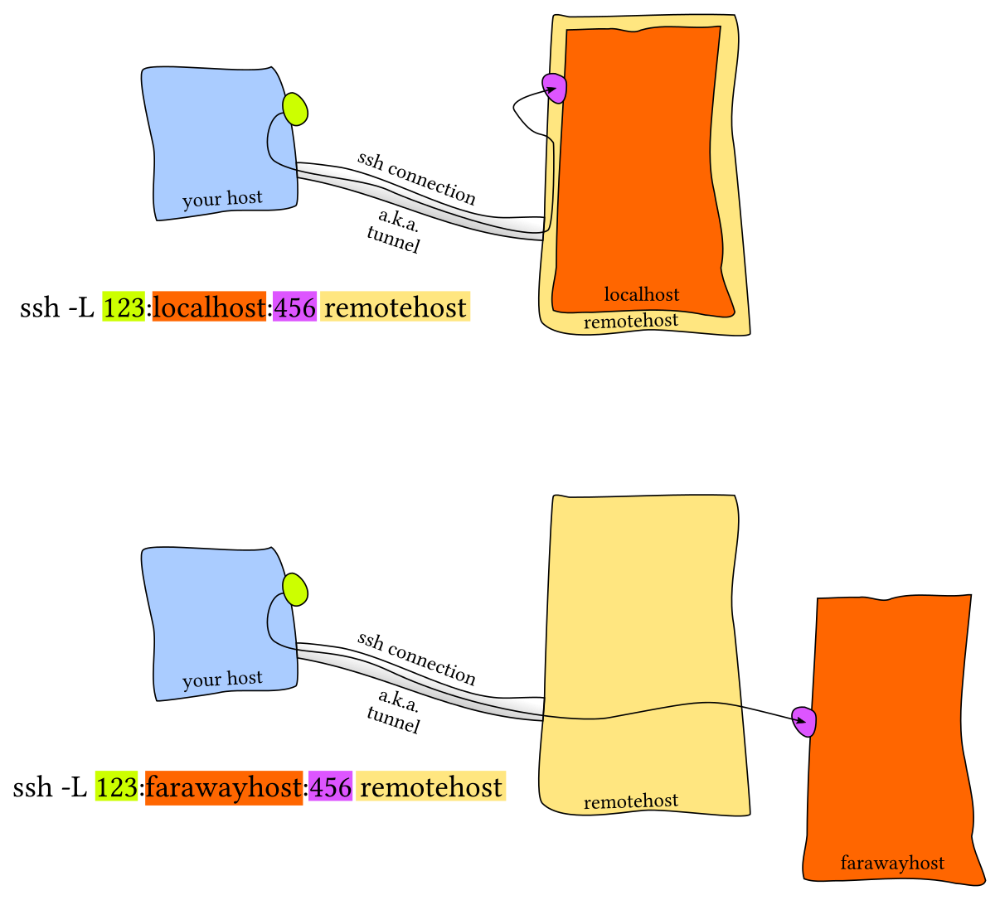

# SSH Port Forwarding

## LocalForward -L
This option is used to specify a connection that will forward a local port's traffic
to the remote machine, tunneling it out into the remote network. The first argument
should be the local port you wish to direct traffic to and the second argument should
be the address and port that you wish to direct that traffic to on the remote end.
LOCAL: -L Specifies that the given port on the local (client) host is to be forwarded to the given host and port on the remote side.
ssh -L sourcePort:forwardToHost:onPort connectToHost means: connect with ssh to connectToHost, and forward all connection attempts to the local sourcePort to port onPort on the machine called forwardToHost, which can be reached from the connectToHost machine.

## RemoteForward -R
This option is used to define a remote port where traffic can be
directed to in order to tunnel out of the local machine. The first argument should
be the remote port where traffic will be directed on the remote system.
The second argument should be the address and port to point the traffic to when it arrives on the local system.
REMOTE: -R Specifies that the given port on the remote (server) host is to be forwarded to the given host and port on the local side.
ssh -R sourcePort:forwardToHost:onPort connectToHost means: connect with ssh to connectToHost, and forward all connection attempts to the remote sourcePort to port onPort on the machine called forwardToHost, which can be reached from your local machine.


## DynamicForward -D
This is used to configure a local port that can be used with a
dynamic forwarding protocol like SOCKS5. Traffic using the dynamic forwarding protocol
can then be directed at this port on the local machine and on the remote end,
it will be routed according to the included values.

## Mind the DIRECTION (small black arrows)
SSH Local port forwarding allow to connect a local port to a remote port
SSH Remote port forwarding allows to tunnel remote port to a local ssh server

# Examples 



```
ssh -R 123:localhost:456 user@remotehost
ssh -R 123:nearhost:456 user@remotehost

ssh -L 123:localhost:456 user@remotehost
ssh -L 123:farawayhost:456 user@remotehost
```
## Additional options
-f tells ssh to background itself after it authenticates
-N says that you want an SSH connection, but you don't actually want to run any remote commands.
-T disables pseudo-tty allocation, which is appropriate because you're not trying to create an interactive shell.

# SSH: On the fly port forwarding.
press ~ and C and Enter
haceker@pc2:~$ 
ssh> help
Commands:
	  -L[bind_address:]port:host:hostport    Request local forward
	  -R[bind_address:]port:host:hostport    Request remote forward
	  -D[bind_address:]port                  Request dynamic forward
	  -KL[bind_address:]port                 Cancel local forward
	  -KR[bind_address:]port                 Cancel remote forward
	  -KD[bind_address:]port                 Cancel dynamic forward


### prepare proxychains
-D 127.0.0.1:9050
[Enter]

### forward the local port 587 to 172.16.0.1:587
-L 587:172.16.0.1:587
[Enter]


tags: #ssh #forward 
