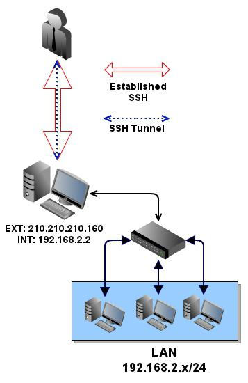
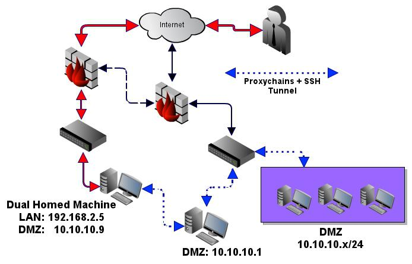

# Pivoting

## Port Forwarding

## Meterpreter

Inside a meterpreter session run `portfwd add -l <localport> -p <remoteport> -r <target host>`

## SSH Static Port Forwarding

Forward all traffic through host:
 `ssh -D 127.0.0.1:8888 -p 22 <user>@<target>`
Forward single port:
 `ssh <user>@<target> -L 127.0.0.1:8888:<targetip>:<targetport>`

## SSH Dynamic Port Forwarding

`ssh -D <localport> user@host` to use this via proxy chains we need to add a local config:
```
strict_chain
quiet_mode
proxy_dns
remote_dns_subnet 224
tcp_read_time_out 15000
tcp_connect_time_out 8000
localnet 127.0.0.0/255.0.0.0

[ProxyList]
socks4  127.0.0.1 8888
'''
```
To use it with command lines use `proxychains -f pivot.conf <tool> <params>`.

## Scanning Networks through Pivots - Pivot via ssh socks - proxychains



### Setup the port forwarding
ssh -D 9090 -C -N -q -f user@server

### the proxychain.conf must contain
socks4 127.0.0.1 9050

### SSH dynamic listener - aka Victim Socks Proxy
ssh -D 127.0.0.1:9050 root@victim

### now scan the internal network (192.168.2.0/24) useing nmap without ICMP ping(pn), without DNS(n), use TCP-Connect-Scan(sT), EnumerateVersion(V)
proxychains nmap -PN -n -sT 192.168.2.* -p- 2>&1 | tee -a scan01.tee.txt

### piggy back the existing tunnel to create a new one into the DMZ network (picture)
proxychains ssh -D 127.0.0.1:9051 user@10.10.10.1

### Proxychaining in folders - fast and easy network switching
Each port should have it's own proxychains.conf file. Proxychains will look for a config file
WITHIN the current working directory. You can than issue the proxychains command
from this directory with whatever command you choose. These tunnels can very easily go on and on,
as you should get the idea by now
```
mkdir dmzNet
cat /etc/proxychains.conf | sed "s/127.0.0.1 9050/127.0.0.1 9051/g" > ./dmzNet/proxychains.conf
```


## SSH Jumphosts

`ssh -J jumpuser1@jumphost1,jumpuser2@jumphost2,...,jumpuserN@jumphostN user@host` for Pivoting through multiple Hosts. Neat to do port forwarding through multiple hosts.


## Socat

Example: Take a connection on 5000 and redirect it to <target ip>:5001
./socat tcp-listen:5000,reuseaddr,fork tcp:<target ip>:5001


tags: pivot forwarding meterpreter
